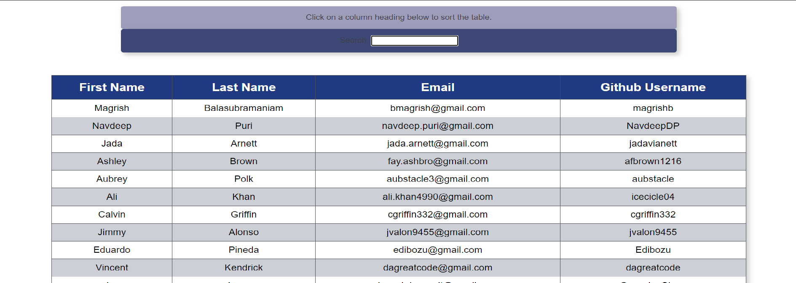

# Getting Started with Create React App

This project was bootstrapped with [Create React App](https://github.com/facebook/create-react-app).

## Available Scripts

In the project directory, you can run:

### `npm start`

Runs the app in the development mode.\
Open [http://localhost:3000](http://localhost:3000) to view it in the browser.

The page will reload if you make edits.\
You will also see any lint errors in the console.

# Employee Directory

Deployed site: https://magrishb.github.io/19-EmployeeDirectory-MB/

This table built using react and [react-table](https://react-table.tanstack.com/) shows the contact info of myself and my classmates from GA Tech's full stack coding Bootcamp in October 2020. Click on any column header to sort the table by that column. Type anything in the search input to filter the table.

